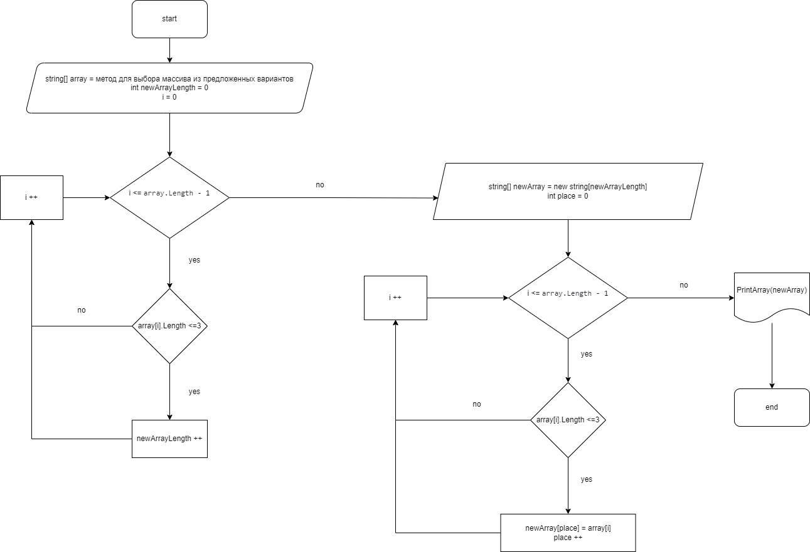

# Итоговая проверочная работа (1 блок)
## Условия задачи
Задача алгоритмически не самая сложная, однако для полноценного выполнения проверочной работы необходимо:

1. Создать репозиторий на **GitHub**
2. Нарисовать блок-схему алгоритма (*можно обойтись блок-схемой основной содержательной части, если вы выделяете её в отдельный метод*)
3. Снабдить репозиторий оформленным текстовым описанием решения (*файл **README.md***)
4. Написать программу, решающую поставленную задачу
5. Использовать контроль версий в работе над этим небольшим проектом (*не должно быть так, что всё залито одним коммитом, как минимум этапы 2, 3, и 4 должны быть расположены в разных коммитах*)

## Задача:

Написать программу, которая из имеющегося массива строк формирует новый массив из строк, длина которых меньше, либо равна 3 символам. Первоначальный массив можно ввести с клавиатуры, либо задать на старте выполнения алгоритма. При решении не рекомендуется пользоваться коллекциями, лучше обойтись исключительно массивами.

**Примеры:**

*[“Hello”, “2”, “world”, “:-)”] → [“2”, “:-)”]*

*[“1234”, “1567”, “-2”, “computer science”] → [“-2”]*

*[“Russia”, “Denmark”, “Kazan”] → []*

## Решение: 
Сперва мною была составлена Блок-схема:
:

Затем я приступил к написанию кода программы:

* сперва написаны методы для ввода пользователем чисел от 1 до 3 с целью выбора массива, метод для вывода на экран выбранного и итогового массивов.
* Затем я, не сообразив, какой использовать метод, почитал статьи в интернете и изучил функцию **switch**, после чего использовал ее для соотнесения введенного пользователем числа с определенным массивом.
* С помощью двух циклов "for" сперва я определил количество элементов, которые перейдут из выбранного массива в итоговый, а затем выбрал именно эти элементы и втавил их в новый массив.
* Используя заготовленный ранее метод вывел на экран выбранный пользователем. и итоговый массивы.

# Задача решена.